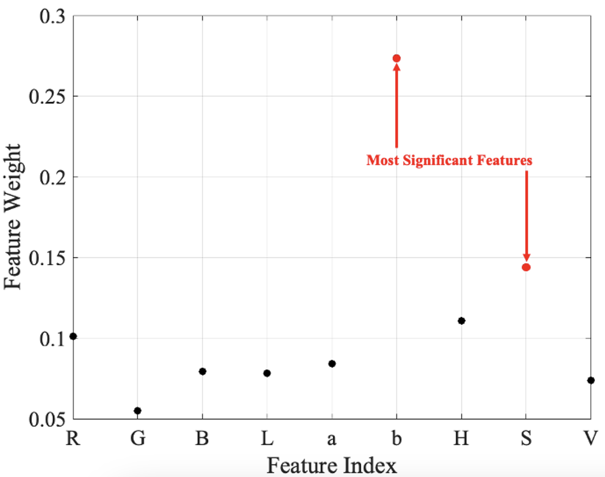

# Feature Selection

This MATLAB code performs feature selection using three algorithms: Neighborhood Component Analysis (NCA), Minimum Redundancy Maximum Relevance (mRMR), and ReliefF. NCA is a distance-based method that assigns weights to features based on their contribution to improving classification accuracy. mRMR selects features that maximize relevance to the target variable while minimizing redundancy among the selected features, resulting in an optimal subset for predictive modeling. ReliefF, an extension of the original Relief algorithm, evaluates feature importance by distinguishing between similar and dissimilar instances. The code also displays the feature rankings generated by each of the three algorithms.

The results generated by the three feature selection algorithms—(1) NCA, (2) mRMR, and (3) ReliefF—are shown in the figure below.

Part of the thesis entitled: "Development of a Non-invasive Vision-based Halochromic Sensor System for Chronic Wound Monitoring"
